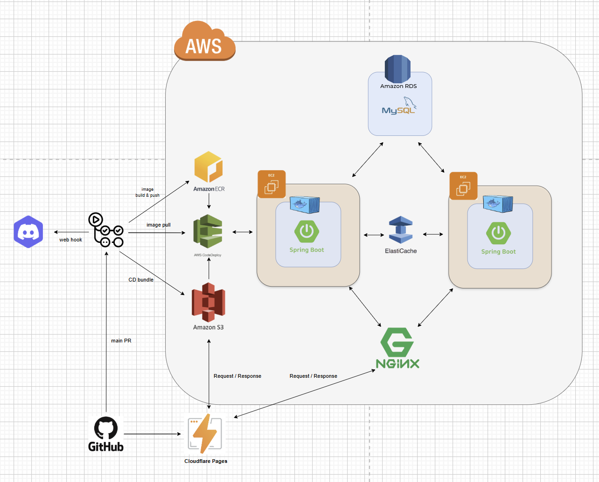
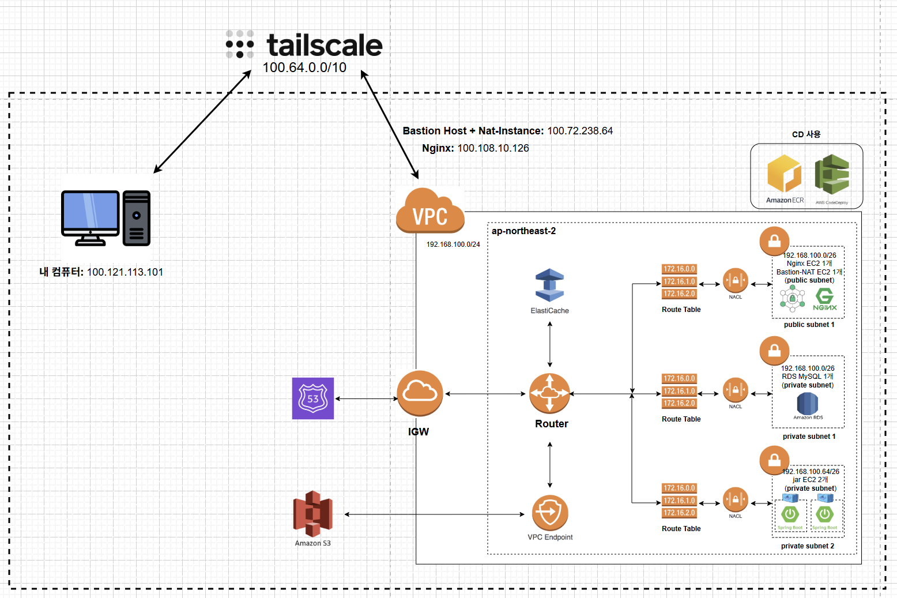

## 🛍️ 프로젝트 개요

<div align="center">
  
</div>

칼하트 구행 자켓은 빈티지 제품이기에 무엇보다 **사이즈 실측 정보가 중요**합니다

현재 칼하트 구행 자켓을 구매할 수 있는 **당근마켓, 번개장터, 크림**과 같은 경우
실측 사이즈를 제대로 전달해주지 않거나 일부 사이즈 정보만 알려주는 경우가 대부분입니다

carhartt_usedTransaction은 중요 **실측 정보와 사진을 필수로 기재**하게 하여
구매자로 하여금 나에게 딱 맞는 칼하트 자켓을 구매할 수 있도록 돕습니다 !

# 🛠 Tech Stack & Tools

<div style="text-align: center;">
  <a href="https://skillicons.dev">
    
  </a>
</div>

| 분류 | 도구 | 활용 내용 |
|:---:|:---:|:---|
| **IDE / Build** |   | Spring Boot 개발 및 의존성 관리 |
| **Infra / DB** |   | EC2/S3 클라우드 환경 구축 및 Docker 컨테이너 활용 |
| **Collaboration** |  | API 명세서 작성, 회의록 및 컨벤션 문서화 |
| **Communication** |  | 실시간 이슈 공유 및 주간 스크럼 진행 |

# 공통 응답 구조 설계

프로젝트의 모든 API는 일관된 경험을 제공하기 위해 표준화된 공통 응답 구조를 따릅니다. 이는 클라이언트(웹/앱) 개발의 편의성을 높이고, 예측 가능한 에러 핸들링을 가능하게 합니다.

### 1. 공통 응답 포맷

모든 응답은 성공과 실패 케이스를 명확히 구분할 수 있는 형태를 가집니다.

*   **성공 시:** `data` 필드에 요청에 대한 결과가 담깁니다.
*   **실패 시:** `error` 필드에 에러 코드(`code`), 메시지(`message`), 그리고 상세 내용(`details`)이 포함됩니다.

**성공 예시**
```json
{
  "success": true,
  "data": {
    "name": "Detroit Jacket Winter 2025",
    "item_price": 150000
  },
  "meta": {
    "timestamp": "2025-09-01T12:00:00Z"
  }
}
```

**실패 예시**
```json
{
  "success": false,
  "error": {
    "code": "I001",
    "message": "상품을 찾을 수 없습니다.",
    "details": []
  },
  "meta": {
    "request_id": "req_...",
    "timestamp": "2025-09-01T12:00:00Z"
  }
}
```

### 2. 설계 이유 및 기대 효과

만약 공통 응답 구조가 없다면, 각 API는 저마다 다른 형식으로 응답을 반환하게 됩니다. 어떤 API는 성공 시 데이터만 반환하고, 실패 시에는 에러 메시지를 문자열로만 보내거나 예측 불가능한 JSON 객체를 반환할 수 있습니다. 이러한 비일관성은 클라이언트 측에서 매번 다른 형식의 응답을 처리하기 위한 분기 로직을 추가하게 만들어 코드를 복잡하게 하고, 에러 처리를 어렵게 만듭니다.

저희는 이러한 문제점을 해결하고 아래와 같은 이점을 얻기 위해 공통 응답 구조를 설계했습니다.

*   **클라이언트의 예측 가능성 확보:** 모든 응답이 동일한 구조를 가지므로, 클라이언트 측에서는 성공과 실패를 일관된 방식으로 처리할 수 있습니다. 이는 프론트엔드 개발 생산성을 향상시키고 휴먼 에러를 줄입니다.


*   **체계적인 에러 관리:** 모든 에러를 `ErrorCode`라는 `enum` 타입으로 중앙에서 관리합니다. 이를 통해 에러 코드가 중복되거나 누락되는 것을 방지하고, 애플리케이션 전체의 에러 상황을 한눈에 파악할 수 있습니다.또한 내부적으로 에러코드를 관리하여 향후 문서화 작업 을 원활하게 할수 있습니다. 에러 발생시 에는 에러코드를 확인하여 문제 해결을 신속하게 할수 있습니다.


*   **다국어 지원 및 메시지 중앙화:** 에러 메시지를 하드코딩하는 대신, Spring의 `MessageSource`를 활용하여 `messages_errors.properties` 파일에서 관리합니다. `ErrorCode`를 키로 사용하여 메시지를 조회하므로, 향후 `messages_errors_en.properties` 와 같은 파일을 추가하는 것만으로 손쉽게 다국어 지원이 가능합니다.


*   **디버깅 및 추적 용이성:** 응답에 포함된 `meta.request_id`는 로깅 시스템(e.g., Logback)의 MDC(Mapped Diagnostic Context)와 연동되어, 특정 요청에 대한 모든 로그를 쉽게 추적할 수 있게 해줍니다. 사용자가 에러를 보고할 때 `request_id`만 전달받으면, 개발자는 해당 요청의 전체 처리 과정을 신속하게 파악하고 디버깅할 수 있습니다. <br>

<br>

# 🚀 주요 기능 소개

본 프로젝트의 핵심 기능을 도메인별로 분류하여 API 엔드포인트와 함께 간략하게 설명합니다.

| 도메인 | API URL | 설명 |
|:------|:--------|:-----|
| **회원** | `POST /api/v1/members/register` | 새로운 사용자 계정을 생성합니다. |
| | `POST /api/v1/members/login` | OAuth2를 통한 소셜 로그인 기능을 제공합니다. |
| | `GET /api/v1/members/profile` | 현재 로그인된 사용자의 프로필 정보를 조회합니다. |
| | `PUT /api/v1/members/profile` | 현재 로그인된 사용자의 프로필 정보를 수정합니다. |
| **상품** | `POST /api/v1/items` | 새로운 상품을 등록합니다. |
| | `GET /api/v1/items/{itemId}` | 특정 상품의 상세 정보를 조회합니다. |
| | `GET /api/v1/items` | 등록된 상품 목록을 필터링 및 페이징하여 조회합니다. |
| | `PUT /api/v1/items/{itemId}` | 특정 상품의 정보를 수정합니다. |
| | `DELETE /api/v1/items/{itemId}` | 특정 상품을 삭제합니다. |
| | `GET /api/v1/categories` | 상품 카테고리 목록을 조회합니다. |
| **주문** | `POST /api/v1/orders` | 선택된 상품들로 새로운 주문을 생성합니다. |
| | `GET /api/v1/orders/{orderId}` | 특정 주문의 상세 정보를 조회합니다. |
| | `GET /api/v1/orders/my` | 현재 로그인된 사용자의 주문 목록을 조회합니다. |
| **결제** | `POST /api/v1/payments/ready` | 결제 서비스 제공자(PG사)와 연동하여 결제를 준비합니다. |
| | `POST /api/v1/payments/callback` | PG사로부터 결제 결과를 전달받아 처리합니다. |
| **찜** | `POST /api/v1/wishes/{itemId}` | 특정 상품을 찜 목록에 추가하거나 해제합니다. |
| | `GET /api/v1/wishes` | 현재 로그인된 사용자의 찜 목록을 조회합니다. |
| **이미지** | `POST /api/v1/images/presigned-url` | AWS S3에 이미지를 직접 업로드하기 위한 Pre-signed URL을 발급합니다. |

<br>


### 디렉토르 계층 구조 (DDD 채택)

```
📂 src/main/java/com/C_platform/
├── 📂 Member_woonkim/          # 사용자 인증 & 프로필 관리
│   ├── domain/                  # Member 엔티티, Value Objects
│   ├── application/             # OAuth2, 로컬 로그인 UseCase
│   ├── presentation/            # 컨트롤러, DTO
│   ├── infrastructure/          # Repository, OAuth 어댑터
│   └── utils/                   # OAuth, 로깅 헬퍼
├── 📂 item/                     # 상품 카탈로그
│   ├── domain/                  # Item 엔티티, Category
│   ├── application/             # 상품 UseCase
│   ├── infrastructure/          # Repository
│   └── ui/                      # 컨트롤러, DTO
├── 📂 order/                    # 주문 관리
│   ├── domain/                  # Order 집합, Value Objects
│   ├── application/             # 주문 생성 UseCase
│   ├── infrastructure/          # Repository
│   └── ui/                      # 컨트롤러, DTO
├── 📂 payment/                  # 결제 처리
│   ├── domain/                  # Payment 엔티티
│   ├── application/             # 결제 UseCase
│   ├── infrastructure/          # KakaoPayAdapter, NaverPayAdapter
│   └── ui/                      # 컨트롤러, DTO
├── 📂 config/                   # Spring 설정
│   ├── SecurityConfig.java      # OAuth2, CSRF, 보안 규칙
│   ├── WebConfig.java           # HTTP 메시지 변환기
│   ├── FileConfig.java          # AWS S3 설정
│   └── RestTemplateConfig.java  # RestTemplate 빈
├── 📂 global/                   # 전역 유틸리티
│   ├── error/                   # ErrorCode, 예외 핸들러
│   └── ApiResponse.java         # 표준 응답 래퍼
└── 📂 exception/                # 커스텀 예외 클래스
```

<br>

# 🛠 Presigned URL을 사용한 S3 이미지 업로드 구조 채택

**Situation** FE에서 상품 이미지를 S3에 업로드할 때, 리사이징 처리를 백엔드(Spring)에서 수행해 달라는 요청이 있었습니다. 하지만 해당 방법이 최선인지에 대한 고민이 있었습니다. **Action** 다음 세 가지 대안을 검토했습니다.

1. 백엔드(Spring) 라이브러리 기반 리사이징 후 S3 업로드
2. 서버를 거쳐 AWS Lambda에서 이미지 리사이징 수행
3. Presigned URL와 FE 라이브러리를 이용한 S3 업로드 세 가지 방안을 검토한 결과, 서버 경유는 불필요한 지연과 비용이 발생한다는 결론을 내렸고 **Presigned URL을 사용한 S3 이미지 업로드 방식**을 채택했습니다. **Presigned URL** Presigned URL은 사용자가 생성한 URL을 통해 지정된 시간 동안 자원에 접근해 줄 수 있게 해 주는 임시 링크로, 클라우드 스토리지 서비스에서 제공하는 기능입니다. 해당 기능을 사용함으로써 클라이언트는 서버를 거치지 않고 리사이징된 이미지를 S3에 업로드할 수 있습니다. 따라서 서버를 거치면서 생기는 비효율적인 낭비를 줄일 수 있습니다.

<br>


## 🏗️ 서버 인프라 (CI/CD + AWS 생태계)

(CICD 배포 구조)
<p align="center"></p>
(인프라 구조)
<p align="center"></p>

### - 🌐️ **인프라 구성 요소 (AWS 생태계)**

#### 1. <u>**Route53** (DNS & 도메인 관리)</u>
- 도메인 이름을 AWS 리소스 엔드포인트로 라우팅
- 백엔드 API: `api.carhartt.com` → EC2 Elastic IP로 라우팅 


#### 2. <u>**CloudFront** - CDN (정적 자산 배포)</u>
- React 빌드 산출물(정적 HTML, CSS, JS) 배포

#### 3. <u>**EC2** - 애플리케이션 서버</u>
- **인스턴스 스펙**: t4g.small (ARM 기반, vCPU: 2개, RAM: 2GB CPU 크래딧)
- **설치 소프트웨어**: Nginx, Docker Engine, AWS CLI v2, codeDeploy agent, docker container(springboot 내장) 

#### 4. <u>**Nginx** (EC2 호스트 레벨에 설치됨)</u>
- 외부 트래픽을 Docker 컨테이너의 Spring Boot 애플리케이션으로 포워딩 <br>(공개 포트: 80 (HTTP), 443 (HTTPS) -> localhost:8080)
- SSL/TLS 종료 (HTTPS 암호화)


#### 5. <u>**Docker Engine**</u>
- EC2에서 Docker Container을 띄우기 위해 사용

#### 6. <u>**AWS S3**</u>
- CI/CD 배포 번들 임시 저장 후 CodeDeploy Agent에게 중개 (CD에 사용) <BR>(파일: `appspec.yml`, `scripts/deploy.sh`, `scripts/nginx_setup.sh`)
- Application에서 사용할 이미지 저장

#### 7. <u>**AWS CodeDeploy Agent**</u>
- GitHub Actions에서 보낸 배포 명령을 수신하고 EC2에서 배포 실행


#### 8. <u>**RDS (MySQL 내장)**</u>
- MySQL 8.0을 내장하여 Application에 영속성 DB 제공

#### 9. <u>**AWS ECR** (Docker Image 저장소)</u>
- GitHub Actions에서 빌드한 Docker 이미지를 저장하고 EC2에 전달

<br/>

### - 📚 개발 환경 분리 (Local, deploy)
**설정 파일 구조:**
```
src/main/resources/
├── application.properties (CI주입)  # 배포 환경 (MySQL, info debug log level)
├── application.properties           # 로컬 환경 (H2(InMemory), debug log level)
├── application-oauth2-local.yml     # 로컬 OAuth2 설정 (여러 dummy 값 사용)
├── application-oauth2-prod.yml      # 배포 OAuth2 설정 (cors 쿠키 설정)
└── *.sql                            # 테스트 데이터 (로컬만)
```
**로컬(Local)** 과 **배포(Production)** 환경을 **Spring Profiles를 활용**하여 분리하였습니다. <br>
배포 환경에서 사용할 환경파일은 CI과정 중 Actions Securtiy Repo에서 주입 받도록 하여 
민감한 값들 (aws, s3, db key들)이 외부로 노출되지 않도록 하였습니다.
 <br>

### - 🚀 CI/CD 배포 구조


**전체 흐름:**

```
┌─────────────────────────────────────────────────────────────┐
│  1. Git Push to main Branch                                 │
│     (GitHub에서 CI/CD 워크플로우 트리거)                      │
└──────────────────┬──────────────────────────────────────────┘
                   │
┌──────────────────▼──────────────────────────────────────────┐
│  2. GitHub Actions CI: 빌드 & 컨테이너 준비                   │
│     ├─ Checkout 코드                                         │
│     ├─ Java 17 & Gradle 설정 (캐싱 포함)                      │
│     ├─ application.properties (Local) 제거                   │
│     ├─ GitHub Secrets에서 설정 파일 주입                      │
│     ├─ ./gradlew build -x test (테스트 생략)                 │
│     ├─ AWS 자격증명 설정                                     │
│     └─ Docker Image (arm64) 생성 & ECR에 Push                │
└──────────────────┬──────────────────────────────────────────┘
                   │
┌──────────────────▼──────────────────────────────────────────┐
│  3. GitHub Actions CD: 배포 번들 준비                        │
│     ├─ appspec.yml (CodeDeploy 설정)                        │
│     ├─ scripts/deploy.sh (Docker 기반 배포)                  │
│     ├─ scripts/nginx_setup.sh (Nginx 설정)                  │
│     ├─ IMAGE_URI 파일 (ECR 이미지 경로 저장)                 │
│     └─ 위 파일들을 ZIP으로 압축하여 S3에 업로드                │
└──────────────────┬──────────────────────────────────────────┘
                   │
┌──────────────────▼──────────────────────────────────────────┐
│  4. AWS CodeDeploy: 배포 명령 전달                           │
│     ├─ S3에서 배포 번들 다운로드                              │
│     ├─ CodeDeploy Agent에 배포 실행 명령                     │
│     └─ appspec.yml 기반 배포 프로세스 시작                    │
└──────────────────┬──────────────────────────────────────────┘
                   │
┌──────────────────▼──────────────────────────────────────────┐
│  5. EC2에서 배포 실행 (deploy.sh)                            │
│     ├─ AWS ECR 로그인 (임시 토큰 발급)                        │
│     ├─ IMAGE_URI 읽어오기 (aws account + commit SHA)         │
│     ├─ ECR에서 Docker Image Pull                             │
│     ├─ 기존 Container 중지 & 삭제                            │
│     ├─ 새 Container 실행                                    │
│     └─ Application 시작 (Port 8080)                         │
└──────────────────┬──────────────────────────────────────────┘
                   │
┌──────────────────▼──────────────────────────────────────────┐
│  6. 배포 완료                                                │
│     ├─ Nginx: localhost:127.0.0.1:8080 로 리버스 프록시      │
│     ├─ RDS MySQL: 데이터 영속성 관리                         │
│     └─ Swagger UI: https://<EC2_IP>/swagger-ui로 확인       │
└─────────────────────────────────────────────────────────────┘
```
**CI/CD 구축으로 얻는 이점 :** <BR>
완성된 기능을 EC2환경에서 테스트 하고 프론트 분들과 공유하기 위해선
프로젝트 개발 중 **반복적으로 배포**가 이루어져야 합니다 <BR><BR>
CI/CD를 한 번 구축해 놓으면 **지정한 branch에 PR을 발생시킬 때마다
자동으로 통합 - 배포**가 이루어지기에 편리합니다 <BR><BR>
또한 CI/CD는 **사람이 직접 배포할 때 발생할 수 있는 실수를 예방**하며,
모든 **팀원이 배포 과정을 숙지하고 있지 않아도 되기에** 분업화에도 탁월합니다.


## 📊 성능 테스트 (K6)

### 개요

K6를 활용한 부하 테스트를 통해 애플리케이션의 성능 목표를 정의하고 검증했습니다.

**성능 목표:**
- **LCP (Largest Contentful Paint)**: 3초 이하 (3초를 초과하면 50% 유저가 이탈)
- **목표 RPS**: 100 (요청/초)
- **목표 응답시간**: 2초 이하 (p95 기준)

### 부하 테스트 전략

**테스트 대상 API:**
1. `GET /v1/items/{item_id}` - 상품 상세 조회
2. `GET /v1/items?keyword=&page=0&size=10&sort=price` - 상품 목록 검색
3. `GET /v1/orders/address` - 배송 주소 목록 조회 (**로그인 필요**)

**VUser 계산:**
```
VUser = 목표 RPS × (응답시간 + thinking time)
VUser = 100 × 1 = 100명 (응답시간 1초, thinking time 0초 가정)
```

### 테스트 결과 (기본 + 극한)

**🧊 Test 1: 기본 부하 테스트 (VUser 100명)**

| 지표 | 결과 |
|:-:|:-:|
| **성공률** | 100% (11,930개 요청) |
| **평균 응답시간** | 491.64ms |
| **p(95) 응답시간** | 1.28s ✓ |
| **최대 응답시간** | 3.02s |
| **RPS (처리량)** | 202.2 req/s |
| **실패율** | 0% |

**결과 해석**: VUser 100명 기준 모든 Threshold 통과 (p95 응답시간 2초 이하)

---

**🔥 Test 2: 극한 부하 테스트 (VUser 100→500 Ramp)**

| 구간 | VUser | 결과 |
|:-:|:-:|:-:|
| **1단계: Warm-up (0→100)** | 0~100 | 안정적 |
| **2단계: Baseline** | 100 | p95=1.28s ✓ |
| **3단계: 중부하** | 100→200 | 안정적 |
| **4단계: 고부하** | 200→300 | 안정적 |
| **5단계: 극한** | 300→400 | ⚠️ Timeout 시작 (34개 요청) |
| **6단계: 피크** | 400→500 | ⚠️ Timeout 증가 (41개 요청) |

**종합 결과:**
- **총 요청**: 101,388개 처리
- **성공률**: 99.96% (41개 실패)
- **평균 응답시간**: 737ms
- **p(95) 응답시간**: 2.38s
- **RPS**: 294 req/s
- **병목 API**: Address API (VUser 400 이상에서 부하)

### 서버 용량 분석

| VUser 범위 | 상태 | 권장 사항 |
|:-:|:-:|:-:|
| **0~350 VU** | ✅ 매우 안정적 | 정상 운영 |
| **350~400 VU** | ✅ 안정적 | 권장 최대값 |
| **400~500 VU** | ⚠️ 부하 증가 | 부분 Timeout |
| **500+ VU** | ❌ 과부하 | 권장하지 않음 |

**실제 사용자 기준:**
- **권장 동시 사용자**: 350~400명 (실제 사용자 600~700명)
- **피크 트래픽**: 최대 500명 (이상 상태 발생)

### 병목 분석 및 개선 방향

**식별된 병목:**

1. **Address API (주소 목록 조회)**
   - VUser 400 이상에서 급격한 성능 저하

2. **Search API (상품 검색)**
   - VUser 400 이상에서 일부 Timeout
   - 안정적 구간: VUser 350 이하

3. **Detail API (상품 상세 조회)**
   - 가장 안정적인 API
   - 모든 부하 수준에서 99%+ 성공률

**추후 개선 사항:**
1. Address API 쿼리 최적화 (캐싱 또는 인덱싱)
2. DB 연결 풀 튜닝 (HikariCP 설정)
3. RDS 성능 향상 (Read Replica 추가)
4. DataDog (APM 분석) 사용하여 모니터링 고도화


<br/>

## 🐝 팀 소개

### TEAM Carhartt


| 이름 |                                        김운강                                        | 김희수  | 정동희  | 장태규  |  수빈  |
|:-:|:---------------------------------------------------------------------------------:|:----:|:----:|:----:|:----:|
| 사진 |  <p align="center"></p>   |   <p align="center"></p>   |   <p align="center"></p>   |   <p align="center"></p>   |   <p align="center"></p>   |
| 역할 |                                        BE                                         |  BE  |  BE  |  FE  |  FE  |
| GitHub | [@woonkim0413](https://github.com/woonkim0413/Carhartt_used_transactions_backend) | [@Tarte12](https://github.com/Tarte12) | [링크] | [링크] | [링크] |


<br/>

