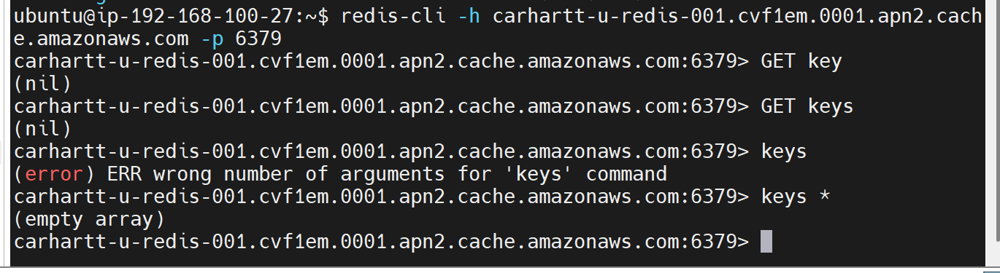

해당 사진을 보면 알 수 있듯이 redis에 값이 안 담겨져 있어
swagger ui로 테스트 해보면 두 번 요청하면 한 번 성공해
이건 내가 가지고 있는 서버가 두 개이고 nginx가 로드 밸런싱을 라운드 로빈으로 하고 있어서
두 번 중 한 번은 서버에 저장된 session이 정상 동작해서 성공하는 것 같아
즉, 아직도 session이 redis가 아니라 servlet에 저장되고 있다는 뜻이지
이유를 분석하고 claude/redis.md 업데이트 해 그리고 해당 작업을 CLAUDE.md에도 업데이트 해
